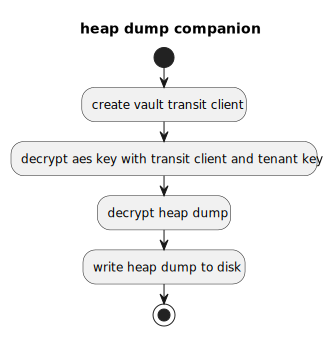

# Heap Dump Companion

Helper binary to seemlesly work with encrypted heap dumps.



## What it does

As all heap dumps are AES encrypted and the AES Key itself is encrypted with Hashicorp Vault's transit encryption, we offer a small companion CLI application to decrypt the heap dump and the AES key in one go.  

### MacOS prerequisites

Maybe OSX is blocking you from execution of downloaded tool.\
Go to directory with extracted tool and execute in shell:
```bash
xattr -d com.apple.quarantine heap-dump-companion
```

The tool should now be executable.

### Usage of heap-dump-companion

Make sure that you are signed into Vault and export your vault token via the environment variable `VAULT_TOKEN`.

```
Companion implementation intended to work with the general heap dump service.

This command takes a encrypted heap dump, the encrypted AES Key of the heap dump and decrypts both
using the transit engine of hashicorp Vault. 

Examples:

heap-dump-companion decrypt --input-file test/test.dump.crypted --output-file test/test.dump --key test/test.key -t some-tenant

Usage:
  heap-dump-companion decrypt [flags]

Flags:
  -h, --help                         help for decrypt
  -i, --input-file string            Path to the encrypted heap dump
  -k, --key string                   Path to the encrypted key that should be used for dectyption
  -o, --output-file string           Desired output file after decryption
  -t, --topic string                 Topic/Tenant owner of the heap dump to be decrypted
  -T, --transit-mount-point string   Transit engine mount point in vault (default "eaas-heap-dump-service")

Global Flags:
  -c, --config string   config file (default is $HOME/.heap-dump-companion.yaml)
```

