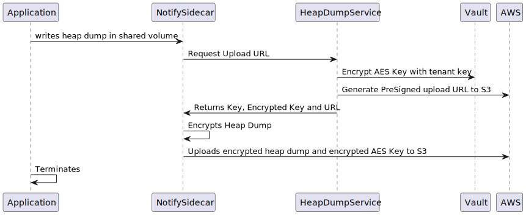
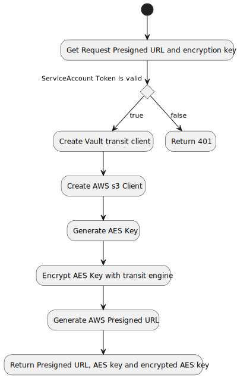

# Heap Dump Service

This is the central heap dump service. A microservice that handles the encryption data and AWS authentication for a central s3 bucket to store encrypted heap dumps.

## What it does

As shown in the Architecture the central heap dump service is responsible to handle the Hasicorp Vault and AWS permissions, as well as generating the cryptographic material needed in order to encrypt heap dumps from different tenants using the transit engine from vault.   
It also ensures that only valid service accounts request these information as the authentication is checked against the kubernetes API.

### Config and Setup

see [config.md](docs/config.md)

