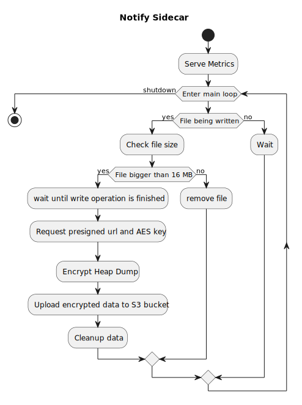

# Notify Sidecar

This is the notify sidecar of the heap dump collection solution. A small sidecar that is responsible of reacting on actively written heap dumps. on completition of the write operation the sidecar will encrypt them and upload them to a central s3 bucket for a tenant.

## What it does

As shown in the Architecture the notify sidecar is doing the actual encryption and upload of a heap dump file. It actively watches a shared volume if heap dumps are written to it and reacts on these.  
Upon detection the notify sidecar will request a presigned upload URL to a central s3 bucket and an encryption key from the heap dump service. This key is encrypted with the transit key of the specific tenant.  
After the heap dump has been written completly, the notify sidecar will encrypt it with the tenants key in AES-256 and upload it via the presigned upload URL. It will also upload the encrypted AES key next to the upload.  
In order to decrypt and use the heap dump, please check the heap-dump-companion documentation.

### Config and Setup

see [config.md](docs/config.md)

